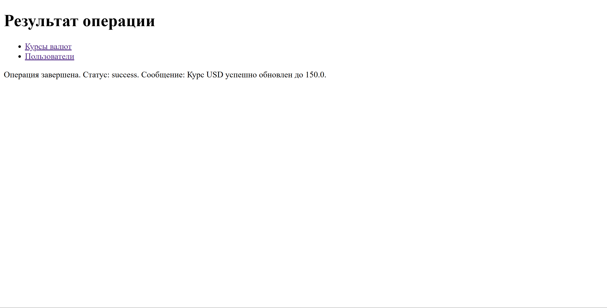
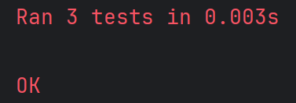

### Отчет по лабораторной работе №9
### CRUD для приложения отслеживания курсов валют с SQLite
Выполнил: Седов Максим, группа P3124
#### 1) Цель работы 
- Реализовать CRUD (Create, Read, Update, Delete) для сущностей бизнес-логики приложения.
- Освоить работу с SQLite в памяти (:memory:) через модуль sqlite3.
- Понять принципы первичных и внешних ключей и их роль в связях между таблицами.
- Выделить контроллеры для работы с БД и для рендеринга страниц в отдельные модули.
- Использовать архитектуру MVC и соблюдать разделение ответственности.
- Отображать пользователям таблицу с валютами, на которые они подписаны.
- Реализовать полноценный роутер, который обрабатывает GET-запросы и выполняет сохранение/обновление данных и рендеринг страниц.
- Научиться тестировать функционал на примере сущностей currency и user с использованием unittest.mock.
#### 2) Описание моделей и базы данных
База данных состоит из трех связанных таблиц. Структура реализована в классе CurrencyRatesCRUD.
Схема данных:  
1. user (Пользователи)  
- id (INTEGER, PK) - уникальный номер.  
- name (TEXT) - имя пользователя.  
2. currency (Валюты)  
- id (INTEGER, PK) - уникальный номер.  
- char_code (TEXT) - буквенный код (например, USD).  
- value (FLOAT) - текущий курс.  
- num_code, name, nominal - дополнительные данные.
3. user_currency (Подписки) 
- id (INTEGER, PK).  
- user_id (INTEGER, FK) - ссылка на пользователя.  
- currency_id (INTEGER, FK) - ссылка на валюту.  
#### 3) Структура проекта
Проект разделен на слои согласно MVC:  
myapp.py (Router) - Точка входа. Запускает сервер, разбирает URL (do_GET) и вызывает нужные контроллеры.  

controllers/:  
- databasecontroller.py - Отвечает за прямое выполнение SQL-запросов.
- currencycontroller.py - Логика для валют (связывает роутер и БД).
- usercontroller.py - Логика для пользователей.
- 
templates/ (Views) - HTML-шаблоны (Jinja2) для отображения страниц.  
lab9Test.py - Модульные тесты с использованием Mock-объектов.
#### 4) Реализация CRUD
Все SQL-запросы параметризованы (используется ? или :name) для защиты от SQL-инъекций.  
- Create (Создание)  
Используется при инициализации приложения для наполнения базы.
```python
def _create_currencies(self, currencies_data: list[dict]):
    sql = """
    INSERT INTO currency (num_code, char_code, name, value, nominal)
    VALUES (:num_code, :char_code, :name, :value, :nominal)
    """
    self.__cursor.executemany(sql, currencies_data)
    self.__con.commit()
```
- Read (Чтение)  
Пример получения списка валют.
```python
def _read_currencies(self) -> list[dict]:
    self.__cursor.execute("SELECT id, num_code, char_code, name, value, nominal FROM currency")
    # ... 
    return currencies
```
- Update (Обновление)  
Обновление курса валюты по её коду.
```python
def _update_currency_value(self, char_code: str, new_value: float) -> bool:
    sql = "UPDATE currency SET value = ? WHERE char_code = ?"
    self.__cursor.execute(sql, (new_value, char_code))
    self.__con.commit()
    return self.__cursor.rowcount > 0
```
Delete (Удаление)  
Удаление реализовано в два этапа из-за наличия внешних ключей. Сначала удаляются подписки, затем сама валюта.
```python
def _delete_currency(self, char_code: str) -> bool:
    self.__cursor.execute("SELECT id FROM currency WHERE char_code = ?", (char_code,))
    # ...
    self.__cursor.execute("DELETE FROM user_currency WHERE currency_id = ?", (currency_db_id,))
    self.__cursor.execute("DELETE FROM currency WHERE id = ?", (currency_db_id,))
    self.__con.commit()
    return self.__cursor.rowcount > 0
```
#### 5) Примеры работы приложения
1. Главная страница
   
2. Список валют (Read)
В таблицу добавлен столбец "Действия" с кнопкой удаления.
   
3. Обновление курса (Update)
Пример запроса через URL: /currency/update?id=USD&value=150.
   
4. Удаление валюты (Delete)
После нажатия кнопки "Удалить" валюта исчезает из списка, а также удаляются все подписки пользователей на неё.
   

#### 6) Тестирование (unittest.mock)
Для тестирования контроллеров использовалась библиотека unittest.mock
Пример теста (удаление):
```python
    def test_delete_currency(self):
        """
        Тестирование метода Delete (удаление валюты)
        Проверяет, что контроллер корректно передает код валюты на удаление в БД
        """
        self.mock_db._delete_currency.return_value = True
        result = self.controller.delete_currency('USD')
        self.assertTrue(result, "Метод должен вернуть True при успешном удалении")
        self.mock_db._delete_currency.assert_called_with('USD')
```
Результаты тестов:  
Тесты успешно пройдены, контроллеры корректно взаимодействуют с базой данных.
 
7) Выводы
В ходе лабораторной работы было создано веб-приложение с архитектурой MVC:
- SQLite и БД: Использование реляционной базы данных позволило связать пользователей и валюты. 
- Маршрутизация: Ручная обработка path и query параметров в методе do_GET дала понимание того, как работают веб-фреймворки "под капотом".
- Контроллеры: Выделение логики в отдельные классы (CurrencyController) упростило код роутера и сделало приложение расширяемым.
- Шаблонизация: Jinja2 позволила отделить Python-код от HTML-верстки, динамически формируя таблицы и списки.
- Тестирование: Применение Mock-объектов показало, как можно тестировать приложения с БД.